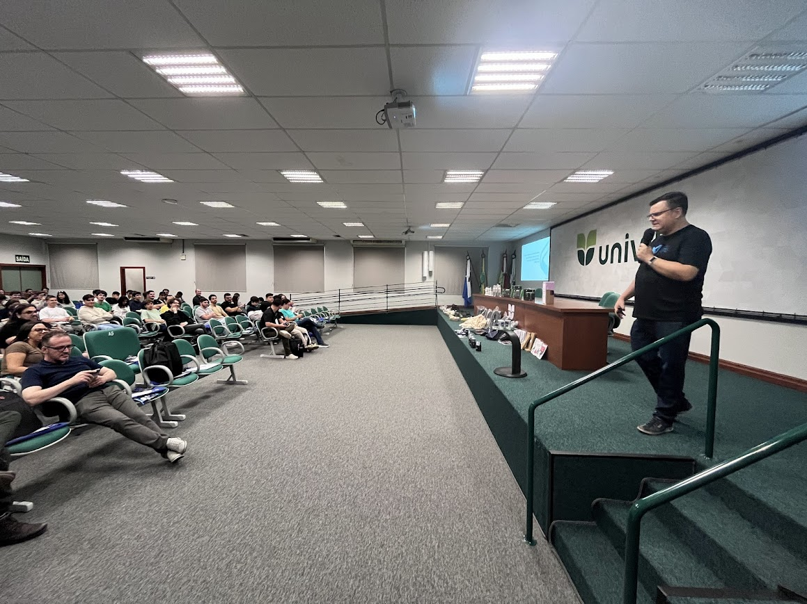
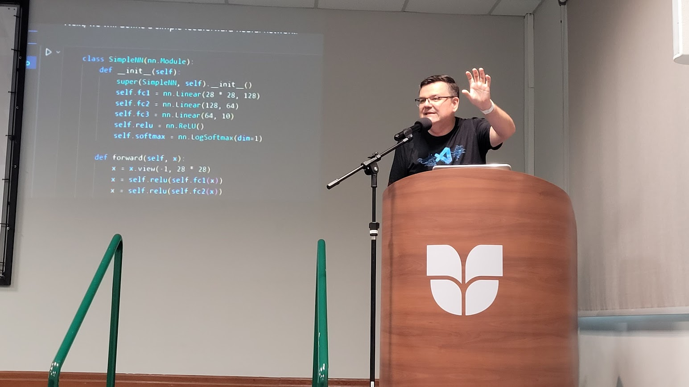
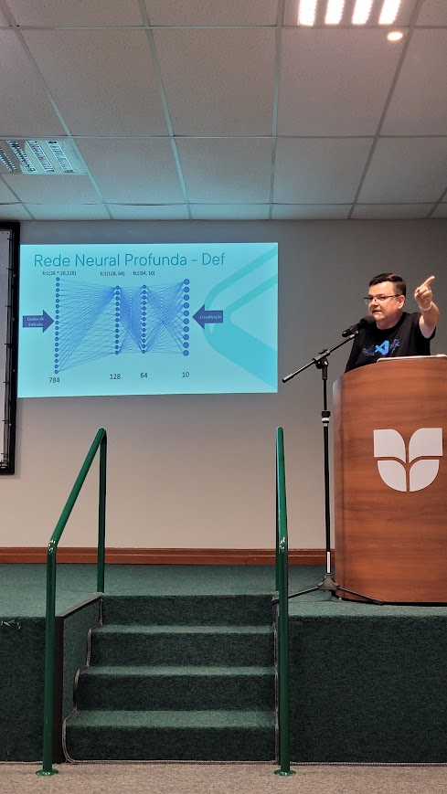
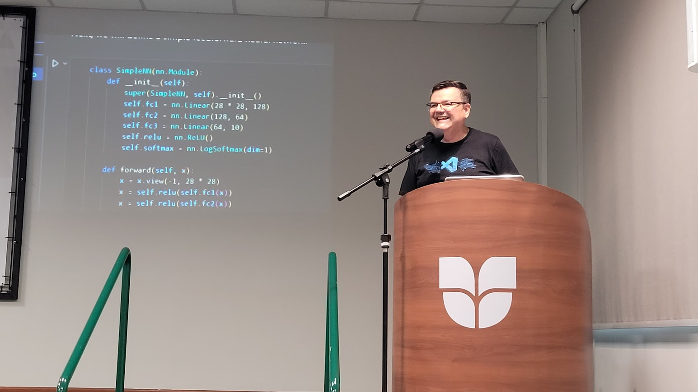
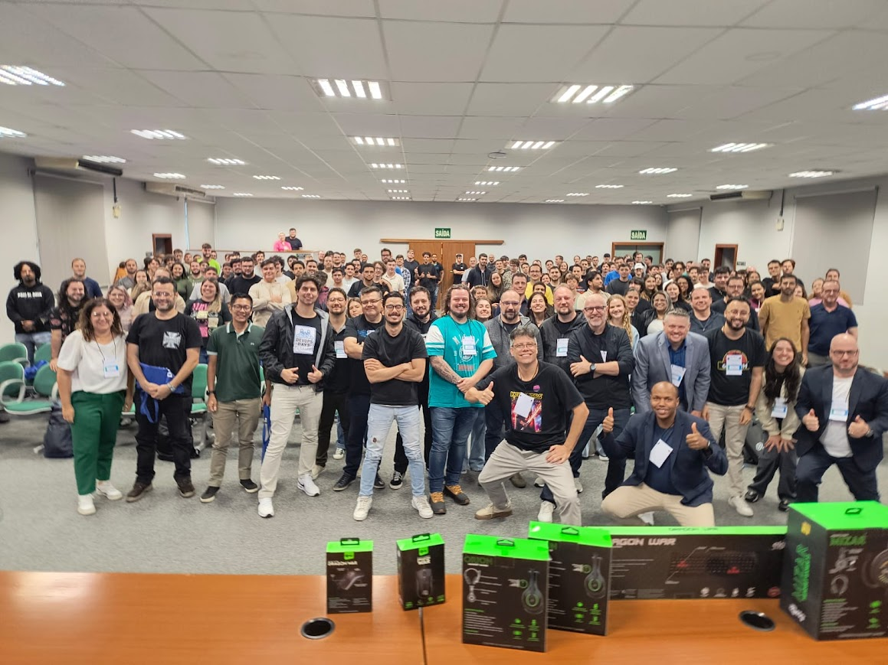

# SQL Saturday Joinville 2025 - Como construir uma rede neural no Azure Machine Learning com a tecnologia Cuda da NVIDIA

Palestra realizada no dia 05 de abril de 2025 no evento SQL Saturday Joinville 2025

## PowerPoint
[PowerPoint Deck](https://pt.slideshare.net/slideshow/palestra-sqlsat-2025-azure-ml-nvidia-cuda/277372465)

[🔐🔐🔐](https://gist.github.com/waltercoan/13ab3f437d5f6949406bfbf1f2167a23)

### Fotos
|  |  |
| -------- | ------- |
|  |  |
|  |  |
|  | |